# What Can Neural Network Embeddings Do That Fingerprints Can’t?

Molecular fingerprints, like Extended-Connectivity Fingerprints (ECFP), are widely used because they are simple, interpretable, and efficient, encoding molecules into fixed-length bit vectors based on predefined structural features. In ADMET property prediction tasks fingerprints are still the state-of-the-art when combined with traditional machine learning methods like XGBoost or Random Forest. In contrast, neural network embeddings are dense, high-dimensional vectors learned directly from data using models like GraphConv, Chemprop, MolBERT, ChemBERTa, MolGPT, Graphformer and CHEESE. These models, trained on millions of drug-like molecules represented as SMILES, graphs, or 3D point clouds, capture continuous and context-dependent molecular features, enabling tasks such as property prediction, molecular similarity, and generative design. The rise of neural network-based representations has raised an important question: Do AI embeddings offer advantages over fingerprints?

## The Performance Paradox

Here’s the catch: in many standard predictive tasks, neural network embeddings do not necessarily outperform fingerprints. Benchmarks from the Therapeutic Data Commons (TDC), which include datasets for properties like bioavailability, lipophilicity, hERG toxicity, and half-life, reveal a surprising trend. As illustrated in the pie chart below, the majority of state-of-the-art (SOTA) results are achieved using “old-school” gradient-boosted trees (e.g., Random Forest or XGBoost) with molecular fingerprints. Only one in four datasets sees SOTA performance from more advanced architectures like Graph Neural Networks (GNNs) or Transformers.

This paradox raises a question:
> If Neural Network or Transformer Models are so much larger and computationally powerful while not outperforming fingerprints in simple prediction tasks, what are their advantages?

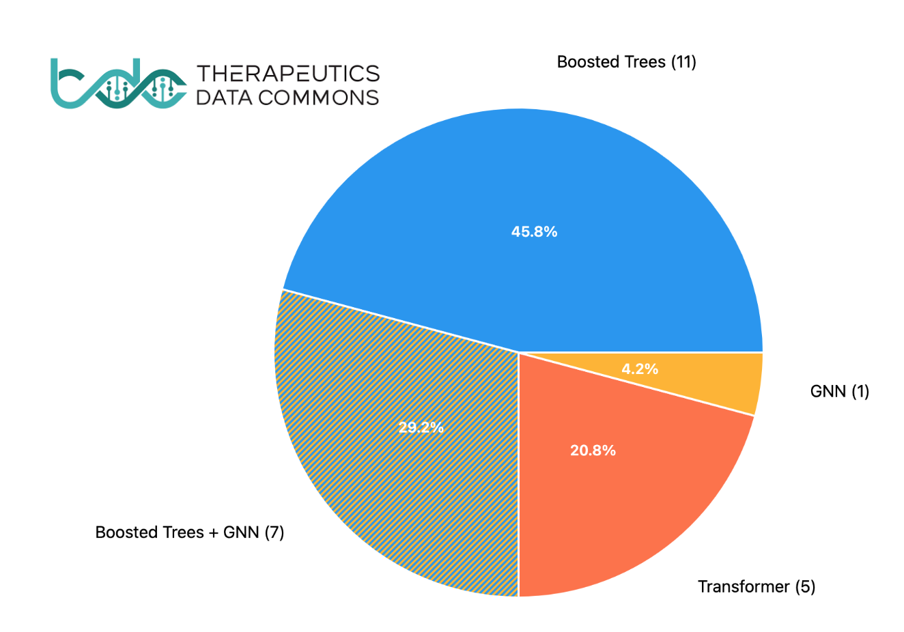
*A pie chart showing SOTA results on the TDC ADMET benchmark, indicating which model types achieved the best performance. All the boosted trees models used fingerprints, boosted trees + GNN means it is an ensemble model.*

## Neural Networks are Superior on Unstructured Data

Traditional algorithms like boosted trees perform exceptionally well on structured data, where relationships and patterns are well-defined and features are engineered. However, they falter on unstructured data, where modalities are diverse and relationships more complex. Neural networks excel in these cases, learning directly from unstructured or qualitative data such as images, audio, or natural language.

Yet in chemistry, some modalities are fairly structured. Representations like 2D molecular graphs, SMILES strings or fingerprints (which encode subgraph patterns) are discrete and inherently systematic, which is why traditional algorithms often perform as well—if not better—than neural networks, especially on small datasets.

> On structured modalities, particularly with small datasets, neural networks offer no inherent advantage over traditional boosted trees paired with binary fingerprints. This trend is clearly reflected in the TDC Benchmark results, where simple approaches often outperform fancy AI methods.

However, when it comes to continuous and unstructured data—especially in the context of large datasets—neural networks reveal their true potential. These are domains where crafting exact equations or simulations is infeasible due to the complexity of the data. Neural models can uncover patterns and relationships that are otherwise hidden, pushing the boundaries of discovery. **Examples include learning from 3D molecular shapes, electrostatics, or solving problems such as protein folding, conformer prediction, partial charge prediction and docking.**

Some of these applications, like protein folding, have already led to Nobel Prize breakthroughs, as seen with AlphaFold. Others, like docking and conformer generation, hold significant promise but are currently constrained by dataset size and the need for better benchmarks to avoid overfitting.

> Neural networks shine in unstructured or continuous modalities, such as 3D molecular shapes, electrostatics and large-scale datasets. Think of protein folding, conformer generation, or docking. In these domains, their ability to learn intricate, non-linear relationships directly from data—and even generate entirely new molecules—enables breakthroughs that traditional approaches cannot match.

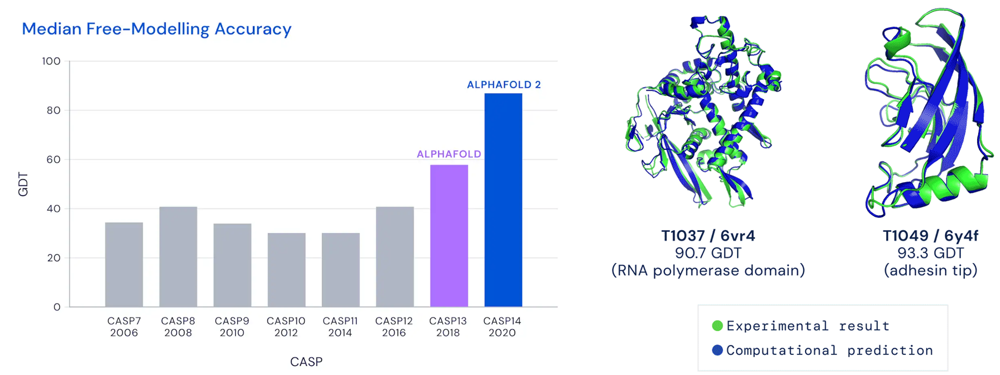
*A figure with Alphafold success in CASP visible on a bar graph (left) and example of protein tertiary structure predictions by it  closely matching experimental results.*

## Smooth Latent Spaces: A Key Advantage

One of the most compelling strengths of neural embeddings lies in their ability to create **smooth latent spaces**, where similar inputs can be interpolated naturally. This feature underpins many modern generative models, such as VAEs, GANs, and diffusion models, and facilitates the **continuous optimization of molecular properties.** Moreover, it gives interpretability to their otherwise black-box nature. Discrete molecular representations, like SMILES strings or molecular graphs, can be transformed into continuous latent spaces, enabling seamless navigation and manipulation through mathematical operations. Selected points in this latent space can then be decoded back into molecular structures, making this approach invaluable for tasks like molecular design and property prediction.

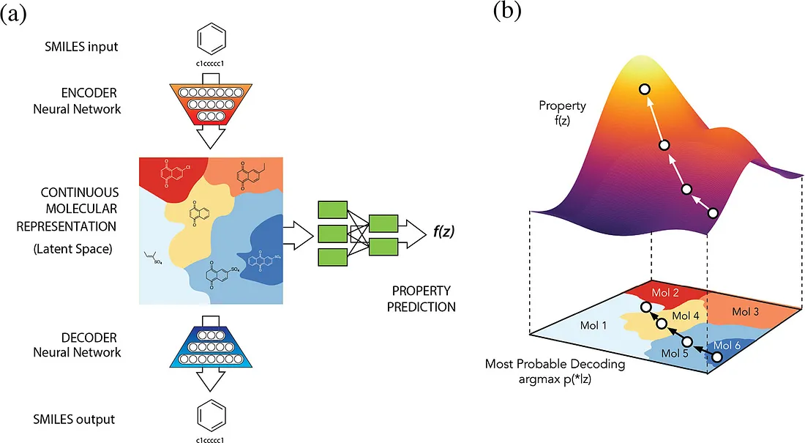
*ChemVAE model latent space*

In these latent spaces, molecular similarity can be computed efficiently using simple metrics like **Euclidean Distance or Cosine Similarity** between vectors. These operations are highly optimized for GPU acceleration, allowing tools like CHEESE [citation] to perform clustering and searches on billion-scale chemical spaces with remarkable speed and efficiency. For example, CHEESE first identifies the most similar cluster by comparing centroid vectors and then refines the search within the cluster, achieving significant performance gains over traditional methods.

In contrast, traditional approaches face severe limitations at scale. For instance, while ROCS struggles with scalability, CHEESE efficiently handles massive datasets by leveraging the inherent advantages of its neural embedding architecture. Similarly, optimization using fingerprints suffers from combinatorial explosion, while clustering methods relying on Tanimoto similarity (e.g., Taylor-Butina) are computationally prohibitive on large datasets, often requiring supercomputers to achieve what CHEESE accomplishes with commodity hardware. 

> A common criticism of neural networks is their perceived “black box” nature. However, neural latent spaces can be visualized, interpreted, and mapped back to the original molecular representations. Tools like CHEESE Explorer make this process intuitive, ensuring that neural embeddings are both practical and interpretable.

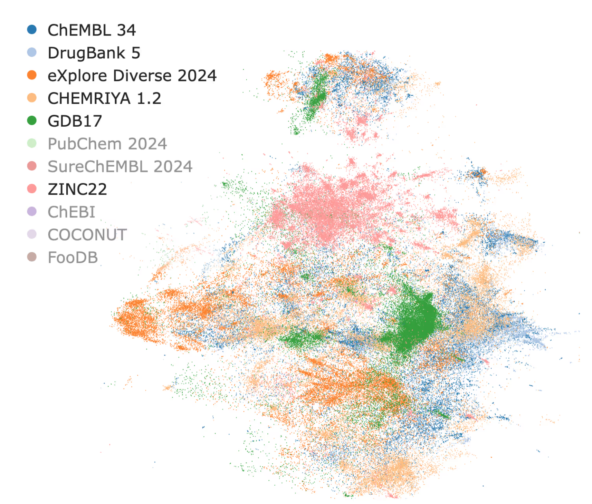
*CHEESE Explorer: a Visualisation app for latent spaces of chemical databases*

## Embeddings as "Inceptions"

To understand what neural embeddings bring to the table, it’s helpful to consider why neural representations often surpass traditional approaches in other fields. A compelling example comes from computer vision, where convolutional neural networks (CNNs) have revolutionized image recognition. Initially, handcrafted features like shape matching or Fourier coefficients dominated, but they were eventually outpaced by neural approaches.

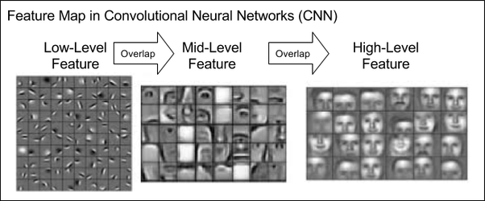

*A depiction of feature maps in a convolutional neural network, progressing from low-level features (e.g., edges) to high-level abstractions (e.g., shapes or objects). CNN learns these features by itself on a face-recognition task.*

This transformation occurred because capturing all possible image modalities manually is nearly impossible. Neural networks, like humans, can learn these modalities automatically from data. Consider the problem of recognizing a cat in an arbitrary image: defining an exhaustive set of equations or handcrafted features to account for every possible pose, background, or lighting condition is impractical. Neural networks overcome this challenge by learning directly from data, producing representations that generalize across scenarios.

## Inception Distance

Neural embeddings can be likened to “Inceptions” in that they provide perceptual representation of data, allowing comparisons at a higher semantic level. Building on this analogy, the “distance” or distribution shift between embeddings can be measured using methods inspired by computer vision, such as the Fréchet Inception Distance (FID). FID, which derives its name from a Convolutional Neural Network (CNN) called Inception, is widely used to evaluate the quality of generated images. By analyzing embeddings rather than raw pixels, FID captures semantic differences, distinguishing visually similar but meaningfully different images (e.g., those with slight shifts, rotations, or added noise). This makes FID a robust measure for assessing the “realness” of images generated by models.

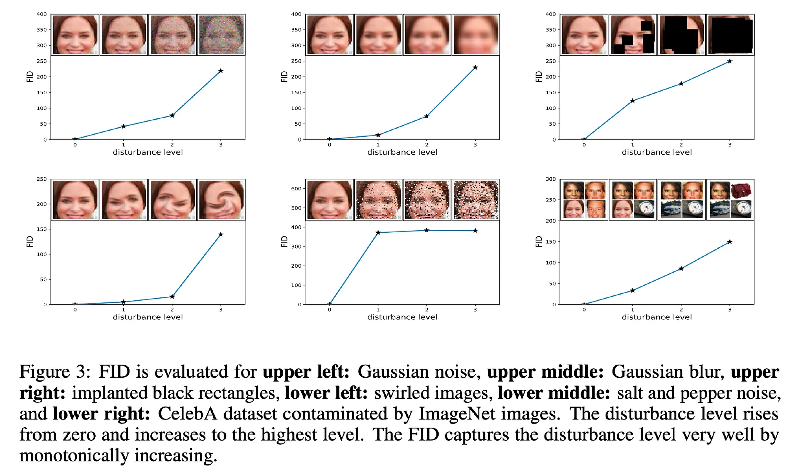
*Figure showing various deformations of an image (noise, blur, mask, vortex, salt and pepper or collage) and corresponding increase in Fréchet Inception Distance.*

In the molecular domain, the Fréchet ChemNet Distance (FCD) adapts this concept to compare distributions of molecular data. FCD evaluates how closely the distribution of molecules generated by a model matches that of a reference dataset, such as ChEMBL, PubChem, or ZINC, by leveraging the activations of a pre-trained neural network. Instead of relying on predefined rules (e.g., Lipinski’s Rule of Five), FCD uses the learned patterns in high-dimensional latent space to assess “drug-likeness” or other chemical properties. This approach excels at detecting subtle yet meaningful differences between distributions.

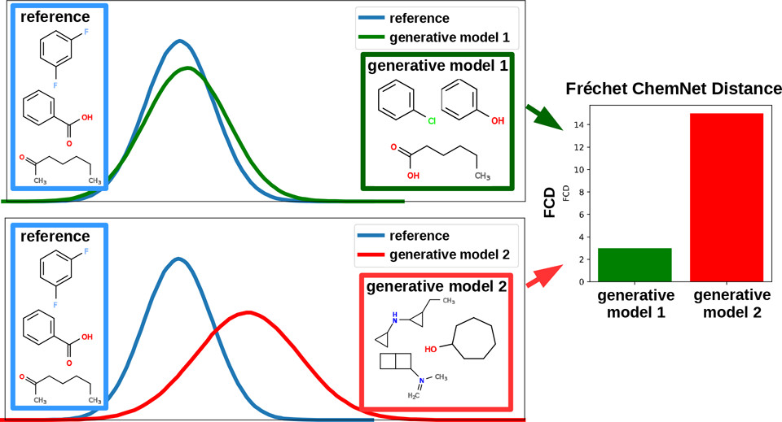
*Graphical Abstract showing distributions of reference database molecules vs molecules by generative models. Valid, yet unplausible or undruglike molecules will have higher FCD from the reference database.*

## CHEESE Chemical Embeddings

CHEESE (Chemical Embeddings Search Engine) leverages neural embeddings to perform advanced similarity searches, prioritizing molecules that align closely with the query not only in 2D structure but also in 3D shape and electrostatic properties. While any trained neural network learns an "inception distance" sui generis, this does not inherently guarantee chemical relevance in applications like virtual screening. CHEESE goes a step further by optimizing its loss function to emphasize 3D shape and electrostatic similarity, ensuring that retrieved molecules are both intuitively relevant and chemically meaningful. This translates to improved recovery of active hits in virtual screening as demonstrated by LIT-PCBA benchmark in the original paper.

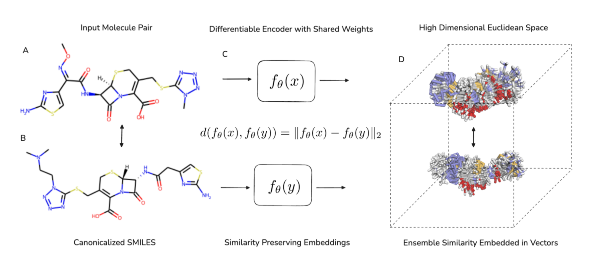
*A diagram of CHEESE architecture*

<!-- 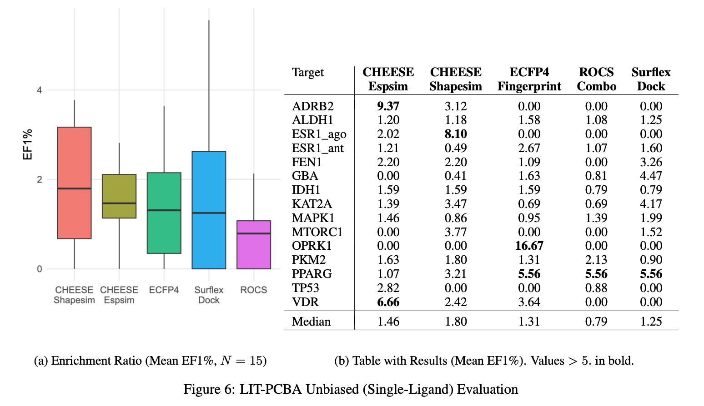 -->

### 3D Shape Similarity
Traditional fingerprints, such as Morgan fingerprints, often fall short when molecular similarity relies heavily on 3D conformation rather than substructural patterns. Neural networks, particularly those designed for 3D molecular data, excel in capturing these spatial relationships, making them invaluable for tasks requiring precise shape and electrostatic comparisons.

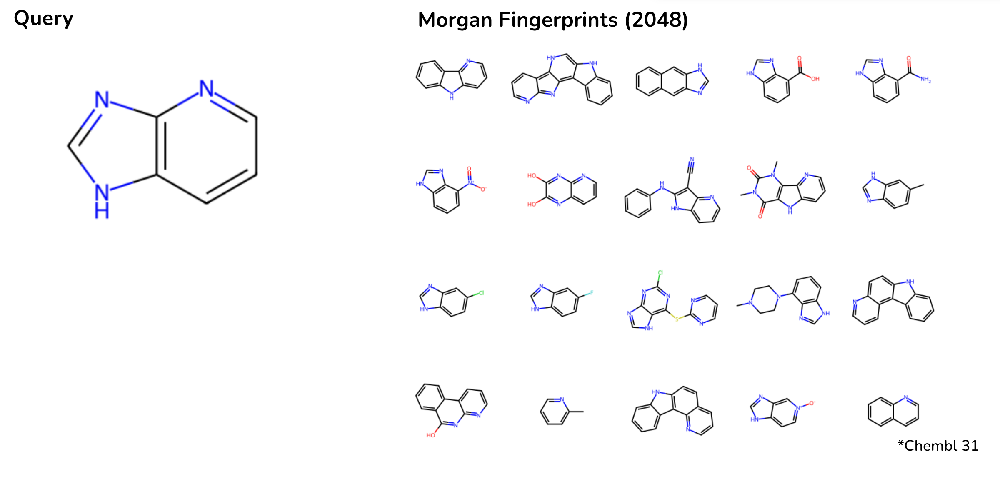

Compared to fingerprints, CHEESE embeddings demonstrate a marked improvement in identifying 3D shape-similar molecules. For instance, in a ChEMBL database search for a small heterocyclic molecule, CHEESE retrieves molecules with closer shape matches than Morgan fingerprints, which often return results with different scaffolds, ring counts, or molecular weights.

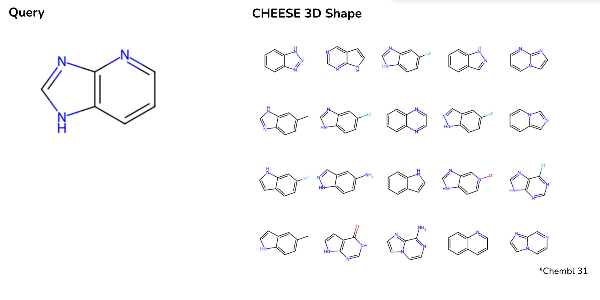

### Electrostatic Similarity

## Beyond Binary Representations

Unlike traditional fingerprints, which reduce molecular information to fixed-length binary vectors, neural embeddings use continuous vectors, enabling more nuanced comparisons. This advantage becomes particularly evident in analyzing electrostatic similarities between molecular fragments.

*Comparison of similarity matrices: Tanimoto similarity for fingerprints (left) versus cosine similarity for CHEESE embeddings (right).*

## Conclusion: Choosing the Right Tool

Neural network embeddings and traditional fingerprints each bring unique strengths to the table, and their utility depends on the specific task at hand. Fingerprints excel in scenarios where simplicity, interpretability, and computational efficiency are paramount—particularly for structured data and small-scale predictive tasks. On the other hand, neural embeddings shine when tackling unstructured or continuous molecular data, enabling breakthroughs in areas such as 3D molecular shape comparison, electrostatic similarity, and generative modeling.

The smooth latent spaces offered by embeddings open up new possibilities for molecular discovery, from generating novel compounds to finding nuanced relationships that fingerprints might miss. Tools like CHEESE exemplify how embeddings can redefine workflows in drug design and materials science, providing chemically meaningful insights that align with experimental observations.

Ultimately, rather than viewing these representations as competitors, it’s more productive to see them as complementary tools. As datasets grow in size and complexity, and as AI models improve, the lines between structured and unstructured tasks will blur further, making the choice of representation less about technical limitations and more about aligning with the goals of the research. For chemists and data scientists alike, the future lies in leveraging the best of both worlds to accelerate discovery.

## References

1. Rogers, D., & Hahn, M. (2010). Extended-connectivity fingerprints. Journal of Chemical Information and Modeling, 50(5), 742-754.

2. Gilmer, J., Schoenholz, S. S., Riley, P. F., Vinyals, O., & Dahl, G. E. (2017). Neural message passing for quantum chemistry. arXiv preprint arXiv:1704.01212.

3. Veličković, P., Cucurull, G., Casanova, A., Romero, A., Lio, P., & Bengio, Y. (2018). Graph attention networks. ICLR 2018.

4. Yang, K., Swanson, K., Jin, W., Coley, C., Eiden, P., Gao, H., ... & Barzilay, R. (2019). Analyzing learned molecular representations for property prediction. Journal of Chemical Information and Modeling, 59(8), 3370-3388.

5. Szegedy, C., Vanhoucke, V., Ioffe, S., Shlens, J., & Wojna, Z. (2015). Rethinking the inception architecture for computer vision. arXiv preprint arXiv:1512.00567.

6. Preuer, K., Renz, P., Unterthiner, T., Hochreiter, S., & Klambauer, G. (2018). Fréchet ChemNet distance: A metric for generative models for molecules in drug discovery. Journal of Chemical Information and Modeling, 58(9), 1736-1741.

7. Schütt, K. T., Kindermans, P. J., Sauceda, H. E., Chmiela, S., Tkatchenko, A., & Müller, K. R. (2017). SchNet: A continuous-filter convolutional neural network for modeling quantum interactions. arXiv preprint arXiv:1706.08566.

8. Chen, T., Kornblith, S., Norouzi, M., & Hinton, G. (2020). A simple framework for contrastive learning of visual representations. International Conference on Machine Learning.

