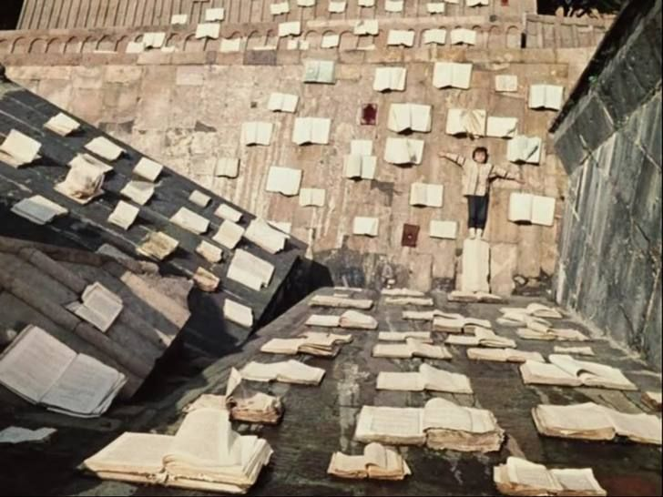

import Admonition from '@components/Admonition.astro';

<Admonition type="info" compact={true}>
    This blog website is relatively new (launched in Spring 2025), but some posts are older than that. For those, the date represents either the original publication date or when I originally wrote the text. 
</Admonition>

There are four main categories of posts on this blog:
- Tech posts  
- Culture & personal blogs  
- Posts written in Czech  
- Links to selected projects, publications, and talks

## Tech Posts

The tech posts will focus primarily on:
- ML/AI  
- Cheminformatics  
- Programming (mostly in Python)  
- Miscellaneous topics (tech opinions, LLMs, bioinformatics, crypto, etc.)

## Culture & Personal Blogs

This section includes:
- Links to some of my past texts (often written in Czech) 
  - Some date back to high school — these will be tagged _High School_
  - Others are from when I studied philosophy or bioinformatics, or worked as a programmer  
  - Note: It doesn't necessarily mean that I like my past texts
- New posts written in English

### I Miss Everyday Writing
I intend to write more casual, shorter pieces on my everyday interests, dependently on my (lacking) spare time:
- Pop culture: audiobooks, video games, anime  
- Fading memories of texts from the humanities that left an impression  
- Papers from niche research areas

### Summary of the Czech Posts

<Admonition type="info" compact={true}>
    In future, more texts from past may appear on this blog. This dependes mostly on my mood and the time invested to find, restore, format and/or republish them.
</Admonition>

These typically cover:
- Philosophy-related works, from school or beyond  
- Literary reviews  
- Reposts of articles originally published in other magazines

Note: So far I have found just a handful of these texts and I don't have the time nor intend to restore or publish most of them.

## What Am I Actually Writing Most of the Time

* For every line of an essay, literary review, or even just a personal note or shopping list, I’ve probably written a thousand lines of code by now.
* Yet there’s something more personal about natural language – its writing has a different rhythm. It’s hard to describe, and I miss it.
* The second biggest contender is chats (Messenger, WhatsApp, Signal...), chats with LLMs (especially in recent years), and anonymous comments on internet forums.
* The third is personal markdown notes of miscellaneous purpose – I’d need to go through them to check what they’re all about. Probably just me organizing my scattered thoughts.

## What I Am Omitting from My Past Works or Do Not Intend to Repost Here

* All works from the time I studied philosophy – sadly, I don’t recall many texts I genuinely relate to from that time. Maybe this will change, but for now, I’m leaving this pile of seminary works untouched.
* Some literary reviews, essays, or works I once wrote but no longer relate to.

  * For instance, a long text about Central European literature from a Deleuzian standpoint I wrote in high school, referencing classics such as Roth, Musil, Kafka, Gombrowicz, Hašek, Schulz, Bernhard, Grass, and Chwin... [Tři dimenze hrdinství ve středoevropské literatuře / Three Dimensions of Heroism in Central European Literature](https://gjk.cz/wp-content/uploads/2019/06/palice_L%C5%BEi%C4%8Da%C5%99_T%C5%99i-dimenze-hrdinstv%C3%AD-ve-st%C5%99edoevropsk%C3%A9-literatu%C5%99e.pdf)
  * Other essays from high school like [Pravda na Hovno / The Truth Is Shit](https://www.vaclavhavel.cz/admnew/_upload/docs/lzicar_miroslav_gymnazium_keplera_praha_1512729594.pdf) (awarded by the Václav Havel Library)
* Most texts written for various school magazines

## Why Am I Doing This
- I'll probably get to this in a future blog post. For now, let's just say it's a way for me to reconcile my past identity and passion for the humanities with my current path.

  
*Illustration: _The Color of Pomegranates_, Sergei Parajanov*

{/* ## Initial Note
- When I created this blog, it looked so empty, so I wanted to fill a space
- I found some old literary reviews, homeworks from high school, scattered notes and essays I – overall nothing i am especially proud of
- I have most of the test i have written – perhaps intetionaly – completely forgotten. And the rest was mostly lost on some disk which denied its service, abandoned email account or paper thrown away during cleanup.
- No more excuses: I decided to put here (or link in this blog) almost anything I will encounter – even the texts I am most embarrased about can at least serve as a reminder that everyone has a right to write slop or write even when lacking talent

## Did I like to write?
- Writing was always kind of a pain in the ass to me. I was as well terrible in grammar and didnt have the necessary patience to turn a barely-legible text into a publishable one. Those who know me will know.
- However, I was fascinated in vocabulary a had a joy of choising words.
- More important than writing itself are the topics – somethimes i had a good topic (a book a liked, an essay which wrote itself), other times it was

## What Am I actually writing most of the time now
- For every line of essay, literary review, fiction or even just a personal note or a shopping list, I have probably written a thousand lines of code now
- The second biggest contender being chats (messenger, whatsapp, signal ...) and anynomous comments on internet forums like reddit
- The third being markdown notes of miscellanous purpose – i would need to go through them to check what they are about 
- There is something more personal about natural language – its writing has a different rythm, its – and I miss it.

## Why to share it with the world
- Honestly, there is no good reason for that
- Maybe a some LLMs will read it, good for them.

## What I miss
- I miss a lot writing trivial texts with a personal touch of what I actually do or like, instead of philosophical books or hoch literatur (well, i like it too – but it sometimes feel like writing a homework – and i don't intend to write like that again – in case i ever commited to such a crime on creativity)
- Writing on disparate topics just to organize my thoughts and excercise my memory (memory which always mixes everything and then recalls a new combination while forgetting the original one)

--- */}
