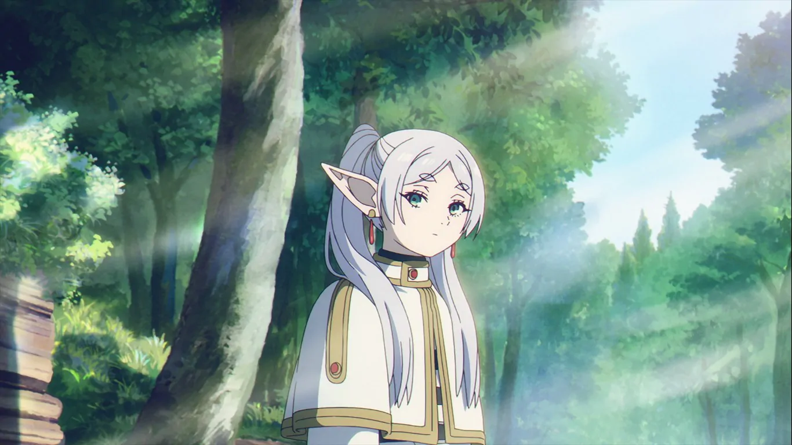

import Admonition from '@components/Admonition.astro';

{/* 
Gemini excerpts: https://gemini.google.com/app/25310c229b198596
 */}

<Admonition type="warning" compact={true}>
    This Text Contains Spoilers from Frieren: Beyond Journey's End.
</Admonition>

In the world of Frieren: Beyond Journey’s End, magic is a mirror reflecting the diverse motivations that drive each character along their chosen path. As we journey with Frieren and her companions, we find that the pursuit of magic rarely follows a single narrative. Sometimes it’s mundane. Sometimes it’s inherited. Sometimes, it exists without any clear reason at all. Yet there is almost always a personal touch to it: Frieren collects spells with the passion of someone pursuing an autistic hobby—spells for cleaning rust off bronze statues or turning sweet grapes sour. Serie is known as a “living grimoire,” yet sees magic more as an elite discipline and competition among the best. Fern doesn’t know why she chose magic in particular; it could have been anything. Flamme, on the other hand, fell in love with it after her parents showed her how to create a beautiful field of flowers.

This post compiles related excerpts from the dialogue (based on the English subtitles of the anime’s first season), sorted into sections by character and topic. It makes no attempt at interpretation.

## Frieren: It's just for my hobby of collecting magic

**Fern:** So, Lady Frieren, does this journey have a purpose?  
**Frieren:** Not particularly. It's just for my hobby of collecting magic.  
...  
**Fern:** Last time it was magic that cleans the rust off bronze statues.  
**Fern:** And before that, magic that turns sweet grapes into sour ones.  
**Frieren:** How is it?  
**Fern:** Sour.  
**Fern:** You're collecting a lot of weird magic.  
**Frieren:** It's my hobby, after all.  
**Fern:** You really like magic, don't you, Lady Frieren?  
**Frieren:** Somewhat. Just like you.  

## Frieren: There was an idiot who praised my collection

**Fern:** Why are you collecting magic, Lady Frieren?  
**Frieren:** It's just a hobby.  
**Fern:** It doesn't look like that to me.  
**Frieren:** It's really just a hobby.  
**Frieren:** I used to live dallying listlessly about.  
**Frieren:** Good grief.  
**Frieren:** *There was an idiot who praised my collection.*  
**Fern:** That's a silly reason.  
**Frieren:** That it is.  

## Frieren: I'm going to try learning more about humans.

**Eisen:** Off to collect more magic?  
**Frieren:** Yeah, there's that too,  
**Frieren:** but I think I'm going to try learning more about humans.  
**Eisen:** I see.  

## Frieren: This is for myself

**Fern:** Is this for Sir Himmel?  
**Frieren:** No.  
**Frieren:** I think this is for myself.  
...  
**Frieren:** This too is a poorly made fake.  
**Fern:** Then why did you accept the job?  
**Frieren:** He seemed troubled.  
**Fern:** I can't imagine it was out of pure goodwill.  
**Frieren:** I suppose so. This is for myself.  

## Fern: It didn't have to be magic

**Fern:** Why do you work so hard for magic?  
**Fern:** I don't understand.  
**Frieren:** You should get it.  
**Frieren:** You didn't give up on becoming a mage, after all.  
**Fern:** That's different.  
**Fern:** As long as I gained the ability to support myself, I didn't care what it was.  
**Fern:** *It didn't have to be magic...*  
**Frieren:** Yet you chose magic.  
**Fern:** I suppose I did.

## Wirbel: Magic as vengeance and civic duty

**Wirbel:** I'll do anything to protect my hometown.  
**Wirbel:** The reason I wanted to be a first-rank mage was for the privilege of getting any spell I asked for.  
**Wirbel:** If I obtain a strong spell, it'll make it that much easier to slaughter demons.  
**Wirbel:** But separately from that, I try to help out people when I can.  
...  
**Wirbel:** What got me this far are those stupid tales of Himmel the Hero.  

## Wirbel: There's no liking or disliking it.

**Serie:** Tell me your favorite spell.  
**Wirbel:** Magic is a tool for killing.  
**Wirbel:** There's no liking or disliking it.  
**Serie:** Pass.  

## Serie: Magic should belong only to the talented

**Serie:** Leave, Frieren.  
**Serie:** I will not follow such a will.  
**Serie:** It's truly unpleasant.  
**Serie:** An age where anyone can use magic?  
**Serie:** *Magic should be special.*  
**Serie:** I intend to only teach those with talent.  

## Serie: You cannot realize what you cannot visualize

**Serie:** You can't visualize yourself as a first-rank mage, can you?  
**Serie:** In the world of magic, you cannot realize what you cannot visualize.  
**Serie:** That's the most basic of fundamentals.

## Serie: Magic like the childish dream of an innocent girl

**Serie:** The Spell That Creates a Field of Flowers.  
**Serie:** A stupid spell that's entirely useless.  
**Serie:** She really loved magic.  
**Serie:** She seriously wished that anyone could use such a spell.  
**Serie:** It made my skin crawl.  
**Serie:** It's like the childish dream of an innocent girl.   

## Flamme: Democratization of magic

**Serie:** In human culture, magic was treated as a demonic art until now,  
**Serie:** and open research was a taboo.  
**Serie:** Flamme is the one who advocated for the change,
...  
**Serie:** Legalizing magic is already a remarkable feat on its own,  
**Serie:** yet she asks for even more?  

## Flamme: If it allows me to eradicate demons

**Flamme:** If it allows me to eradicate them (demons),  
**Flamme:** *I'll gladly embrace that dishonor.*  

## Flamme: My favorite spell creates a beautiful field of flowers

**Frieren:** But I love magic.  
**Flamme:** I love it too.  
**Flamme:** That's why no one but us should need to make such an underhanded mockery of magic.  
...  
**Flamme:** Frieren. My favorite magic creates a beautiful field of flowers.  
**Flamme:** My parents taught it to me when I was young.  
**Flamme:** It's the reason I came to love magic.  

## Lügner: A single form of magic perfected over time

**Lügner:** We demons dedicate our long lives to the research of a single form of magic.  
**Lügner:** Our magic is the accumulation of all the years we've lived in pursuit of it.  
**Lügner:** Each year, we further refine our magic, pushing our power to even greater heights.  

## Demons: Mana is to them what status and wealth are to humans

**Flamme:** Mana is to them (demons) what status and wealth are to humans.  
**Flamme:** You could say it's a matter of dignity to them.  

## Übel: Magic reflects your life and character

**Übel:** You know, I believe the spells people are proficient in reflect their life and character.  
**Übel:** It's always been like that for me.  
**Übel:** If I can empathize with a spell, I'll be able to use it.  
**Übel:** If I can't empathize with it, I won't.  

## Übel: Magic is the art of visualization

**Übel:** I'm talking about visualization.  
**Übel:** Cloth is something you can cut. Everyone knows that.  

## Denken: Magic as an active pursuit

**Denken:** Magic is most enjoyable when you're pursuing it.  
**Denken:** It's that simple.  

## Denken: Magic was a tool, then it became fun again

**Denken:** Fern. Magic was only a tool for politics to me.  
**Denken:** Could you tell Frieren that she allowed me to remember how fun magic used to be to me?  
**Denken:** I became a mage out of admiration for Frieren of the heroes' party.  

## Denken: I wanted to visit a grave

**Laufen:** Gramps, why would you go so far to become a first-rank mage? Don't you already have wealth, authority, and anything else you might want?  
**Denken:** I'm from deep in the Northern Plateau.  
**Denken:** Only first-rank mages can go there now due to the rampaging of the demons.  
**Denken:** It's been a while, and I wanted to visit a grave there.  
**Denken:** That's it.