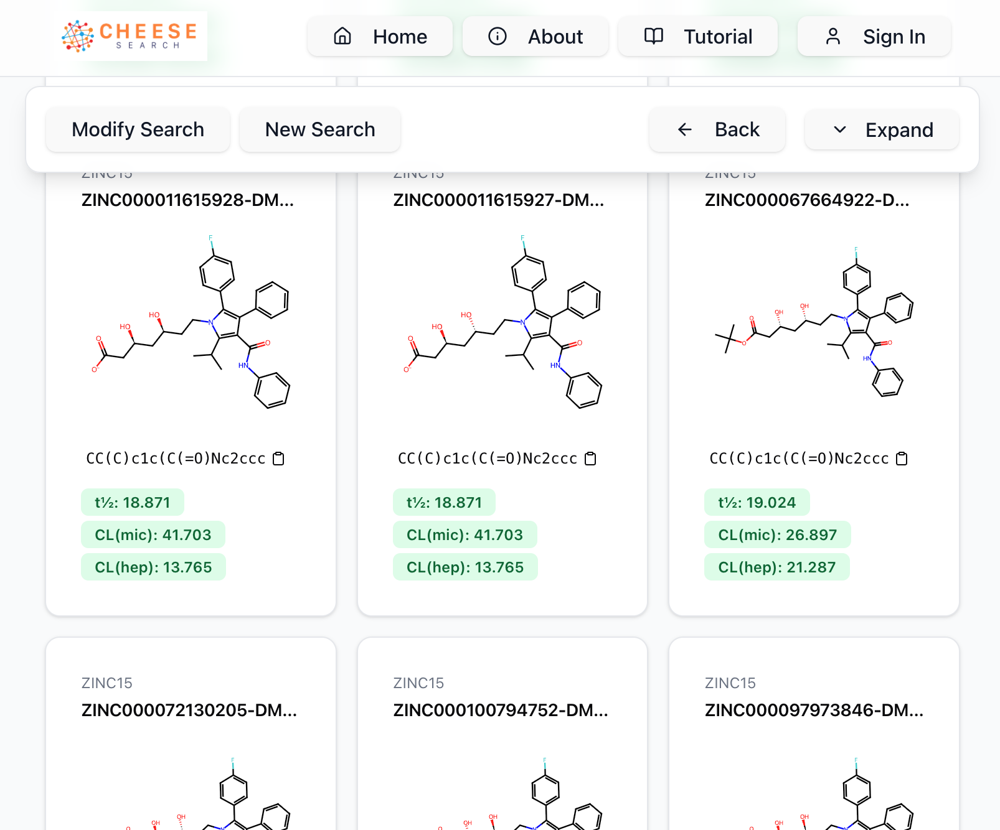
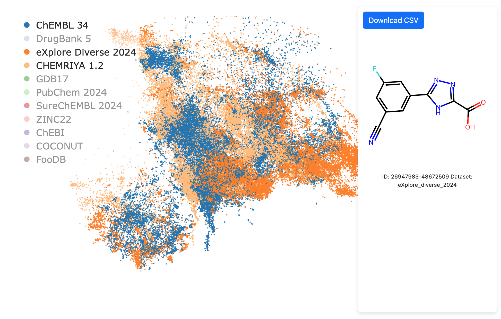
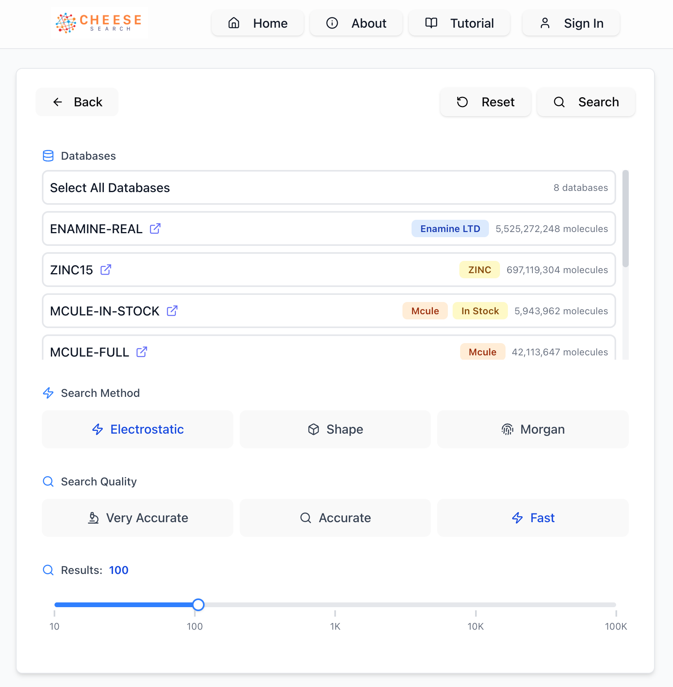
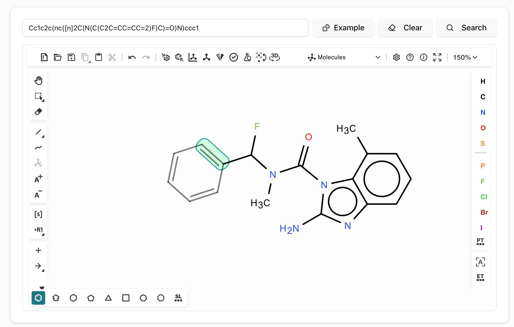

import Table from '@components/Table.astro';
import References from '@components/References.astro';
import Citation from '@components/Citation.astro';
import Cite from '@components/Cite.astro';


When I wrote my first line of code as a kid, it was probably a script to self‑host a Minecraft server, a program for a LEGO robot written in C, a Linux Bash script, or a bit of Java in Processing. Later, I relied heavily on Python and Jupyter Notebooks for data analysis. Web or frontend? I wasn’t interested at all—it felt *so boring*. I was wondering, how many talented people are stuck doing this and if it requires the degree in computer science they have.

Long story short, in my first full-stack job I programmed in Python and Flask<Cite id="flaskDocs" />, making a simple UI using Jinja templates and Bootstrap. It worked up to a point, but every time I needed to go beyond what the templates provided, it was a pain in the ass. In later projects I usually used a combination of Streamlit<Cite id="streamlitDocs" />, Dash<Cite id="dashDocs" />, and Flask. Most of the time I picked the *lowest‑friction* toolset, crafting the frontend out of necessity, not because I enjoyed it. To be fair, I was more of a backend developer, so it wasn't expected from me.

Last fall I skimmed through some React<Cite id="reactDocs" /> basics and soon fell in love. Now I'm building production-grade frontends with React. The transition has been incredibly rewarding - frontend development is far more engaging than I initially thought.



*Example: [CHEESE Search](https://cheese-new.deepmedchem.com) UI I wrote in React.*

## My frontend stack now at Deep MedChem

Let's jump to the present. As a case study I will go through apps I did at my current job. You can see a lineup from Streamlit prototypes (such as Electrostatics or Modeller) to a Flask + Dash dashboard in Explorer, up to the UI I'm currently most proud of: CHEESE Search. Note: you can learn more [here](https://www.deepmedchem.com/products-and-services/cheese-search) or [here](https://cheese-new.deepmedchem.com/about) about this molecular search.

<Table
  headers={["Product", "Stack", "Website"]}
  rows={[
    ["CHEESE", "React + TypeScript + Vite + Tailwind", "<a href='https://cheese-new.deepmedchem.com'>cheese-new.deepmedchem.com</a>"],
    ["Explorer", "Flask + Python + Dash + HTML/CSS", "<a href='https://explorer.deepmedchem.com/'>explorer.deepmedchem.com</a>"],
    ["Electrostatics", "Streamlit + Python", "<a href='http://electrostatics.deepmedchem.com/'>electrostatics.deepmedchem.com</a>"],
    ["Modeller", "Streamlit + Python", "<a href='http://modeller.deepmedchem.com/'>modeller.deepmedchem.com</a>"],
    ["Deep MedChem", "Webflow", "<a href='https://deepmedchem.com/'>deepmedchem.com</a>"]
  ]}
  striped={true}
  bordered={true}
  hover={true}
/>

## Which technology to choose?

I have no strong opinion about what is better: the right approach is to know what the end-product should be. 

* Need an MVP overnight? Pick Streamlit.
* Hassle‑free CRUD with SQL? Use Flask<Cite id="flaskDocs" /> + SQLAlchemy.
* Production‑grade, highly maintainable UI, even if it takes twice as long to write and type‑check? Go for React<Cite id="reactDocs" /> + TypeScript.

## Distinction between dashboards, widgets and webpages

Since some of the apps I did contained complex plots or interactive data visualization elements, I learned it's crucial to separate webpage projects from dashboard projects. For instance, Plotly or Dash excel at creating pages full of interactive elements with real-time updates, but you usually cannot make a full-blown app in Dash alone.


*Example: [Explorer](https://explorer.deepmedchem.com) An app for interactive visualisation written in Dash. Supports fancy interactive plots in 2D as well as 3D.*

The integration problem becomes clear when you consider the technical constraints: Plotly.js alone is ~4MB minified, and Dash adds another ~2MB of dependencies. When you try to embed these into a React app, you're looking at 6+ MB just for charting—before your actual application code. This severely impacts page load times, especially on mobile networks. Additionally, Dash's callback system conflicts with React's state management, leading to unpredictable re-renders and memory leaks.

For CHEESE Search, I initially tried embedding the molecular drawing component directly into the main React interface. The bundle size ballooned to 20+ MB, and the drawing interface was sometimes glitching due to conflicting event handlers. The solution was to deploy it separately and embed it as an iframe, keeping the main React app lightweight while preserving the interactive functionality.

### Bundle Size: Before Optimization

The original build with embedded components resulted in an enormous bundle:

```
vite v6.2.0 building for production...
✓ 3982 modules transformed.
dist/sitemap.xml                                  1.06 kB
dist/index.html                                   6.34 kB
dist/assets/editor-styles.css                     9.52 kB
dist/assets/index.css                            98.00 kB
dist/assets/EditorComponent.css                 150.31 kB
dist/assets/runtime.js                            0.29 kB
dist/assets/index.js                              0.29 kB
dist/assets/EditorComponent.js                    0.97 kB
dist/assets/badge-component.js                    1.94 kB
dist/assets/DatabaseView.js                      14.20 kB
dist/assets/MoleculeSVG.js                       27.40 kB
dist/assets/chem-toolkit.js                      31.71 kB
dist/assets/Search.js                            78.38 kB
dist/assets/ResultsGrid.js                       79.70 kB
dist/assets/MoleculeSearch.js                   106.79 kB
dist/assets/index-bundle.js                     250.18 kB
dist/assets/vendor.js                           358.26 kB
dist/assets/legacy-bundle.js                  1,124.92 kB
dist/assets/modern-bundle.js                  1,261.83 kB
dist/assets/editor-core.js                   21,359.13 kB

19 chunks of 23.80 MB (gzip: 7.15 MB | map: 40.62 MB)
✓ built in 3m 19s
```


### Bundle Size: After Optimization

By doing various optimizations and moving the heavy component to a separate iframe, the main bundle became dramatically smaller:

```
vite v6.3.5 building for production...
✓ 1868 modules transformed.
dist/sitemap.xml                                  1.06 kB
dist/index.html                                  10.48 kB
dist/assets/css/index.css                       137.94 kB
dist/assets/chevron-icon.js                       0.38 kB
dist/assets/download-icon.js                      0.45 kB
dist/assets/check-icon.js                         0.65 kB
dist/assets/page-layout.js                        1.65 kB
dist/assets/vendor-search.js                      1.93 kB
dist/assets/FloatingMenu.js                       5.04 kB
dist/assets/editor-optimized.js                  10.02 kB
dist/assets/download-status.js                   11.40 kB
dist/assets/database-view.js                     15.53 kB
dist/assets/query-handler.js                     25.23 kB
dist/assets/chem-toolkit.js                      29.04 kB
dist/assets/privacy-policy.js                    31.71 kB
dist/assets/terms-conditions.js                  43.46 kB
dist/assets/about-page.js                        55.35 kB
dist/assets/tutorial.js                          72.78 kB
dist/assets/results-grid.js                      74.00 kB
dist/assets/vendor.js                            79.04 kB
dist/assets/index.js                            379.41 kB
dist/assets/ui-library.js                       385.49 kB

22 chunks of 1.30 MB (gzip: 362.89 KB | map: 4.24 MB)
✓ built in 12.25s
```

The results speak for themselves: **from 23.80 MB to 1.30 MB**—an 18x reduction in bundle size and 16x faster build times. The iframe approach isolated the heavyweight molecular editor while maintaining all functionality.


## Simple vs Complicated: What I hate in modern web dev

What intimidated me during my first React<Cite id="reactDocs" /> "Hello World" was the sheer number of files. While most developer tools get simpler year after year, web dev seems to have become 10x more convoluted compared with the days when HTML, PHP, and CSS were enough.

To illustrate my point, take how it looks after you create a new, say, NextJS<Cite id="nextjsDocs" /> project (excluding gitignored files):

```
└── hello_world
    ├── app
    │   ├── favicon.ico
    │   ├── globals.css
    │   ├── layout.tsx
    │   └── page.tsx
    ├── eslint.config.mjs
    ├── next.config.ts
    ├── package-lock.json
    ├── package.json
    ├── postcss.config.mjs
    ├── public
    │   ├── file.svg
    │   ├── globe.svg
    │   ├── next.svg
    │   ├── vercel.svg
    │   └── window.svg
    ├── README.md
    └── tsconfig.json

4 directories, 16 files
```

And compare it with a similar streamlit project:
```
hello_world.py
```

And a simple code enough to produce a solid, modern webpage:
```python
import streamlit as st

st.title("Hello, world! 👋")
```

## When Streamlit is (not) enough

If you have a simple use case: an app with three buttons and a table, chat window, simple plotting dashboard, deployment of an AI model from Hugging Face or a search bar and results, in almost all cases Streamlit (or Gradio or other such frameworks) will serve the purpose well. Again: what you get just for a few lines of code is unparalleled.

 
*Example: [Electrostatics](https://electrostatics.deepmedchem.com) A streamlit UI for molecule partial charges.*

However, the dark side of such an easy way to make a frontend is that these *relatively new* frameworks are still somewhat experimental and can be glitchy or buggy at times. For instance, Streamlit is not well-suited for complex interactivity and sometimes flickers or displays ghost components. There are deeper technological reasons why it's difficult (or maybe currently impossible) to generalize this paradigm and simplify all web development using this approach—mainly because these frameworks abstract away too much control over the DOM and state management.

*Tip: Checkout the Streamlit App Gallery<Cite id="streamlitGallery" /> to get a gist of what it can do.*


*This [CHEESE Search](https://cheese-new.deepmedchem.com) database selection widget with a slider and a multiselect wouldn't be a huge problem to replicate in streamlit*

## Where I ended up

My go-to stack when creating a new app consists of Vite<Cite id="viteDocs" />, Express<Cite id="expressDocs" /> and React/TypeScript, usually enhanced by Tailwind CSS<Cite id="tailwindDocs" /> and Shadcn-UI<Cite id="shadcnUi" /> as a component library. Sometimes I'm trying new things: for instance this blog page is written in Astro<Cite id="astroDocs" /> and in other projects I have encountered Next.js<Cite id="nextjsDocs" /> or Vue<Cite id="vueDocs" /> (though I have no experience with them).


*[CHEESE Search](https://cheese-new.deepmedchem.com) Ketcher drawing pad with search bar and some buttons*

## Specific challenges React/TypeScript solved for me

The transition to React/TypeScript wasn't just about preference—it solved real problems I faced while building:

**State Management Complexity**: CHEESE handles multiple simultaneous search queries across different databases (Enamine REAL, eXplore, ZINC15, etc.). In Flask, I would manually manage search state with session variables and encounter race conditions with multiple searches. React's component state and useEffect hooks made it trivial to handle concurrent searches with proper cleanup.

**Type Safety**: With CHEESE dealing with complex molecular data structures (SMILES strings, similarity scores, vendor information), TypeScript caught dozens of bugs before they reached production. For example, when integrating multiple chemical databases with different response schemas, TypeScript forced me to handle all possible data formats explicitly.

**Component Reusability**: The molecular drawing interface (Ketcher integration), database selection widgets, and similarity score displays are now reusable components. I can drop the same molecular drawing pad into different contexts without rewriting the integration logic—something that would be impossible without clever iframing and component architecture.

**Real-time Updates**: CHEESE search results stream in as they're computed (see for instance the infinite scroll). React's state updates made it straightforward to show partial results or progress indicators and then update them, while in Flask I was stuck with either full page reloads or complex JavaScript callbacks.

**Bundle Optimization**: Despite the complexity, my current CHEESE build is under 1MB gzipped thanks to Vite's tree-shaking and code splitting. That was a surprise for me: with my old habits I would expect much larger build.


## Vibe-coding tips

Tailwind CSS<Cite id="tailwindDocs" /> is a life-hack if you're using GPT to help you design your page. Large language models sometimes struggle remembering long context or making edits in multiple files at once, and having inline CSS simplifies this a lot. TypeScript is a must-have as well, because it prevents LLMs from introducing easily-preventable bugs and forces them to be type consistent across the whole codebase.

At this point in time (June 2025) I don't find LLMs 100% useful in medium to large TypeScript codebases. A few weeks ago I was still manually selecting code snippets from relevant files and copy-pasting them to another window with LLM chat opened, then I checked the generated results and inserted them back, all while writing significant parts of the code by hand. Only recently I started to play with tools such as Roo Code<Cite id="rooCode" /> or Aider<Cite id="aider" />—I haven't yet gotten fully used to it, but I strongly believe it will sooner or later make frontend coding a thing of the past, maybe taking out the human feeling of satisfaction when code typed line by line using your fingers and a keyboard finally works.

## Conclusion

My journey from Flask templates to React wasn't just about following trends—it was driven by real technical needs. Building CHEESE Search taught me that the right tool depends entirely on the problem you're solving. Streamlit is perfect for prototypes, Flask handles simple CRUD well, but for complex, interactive applications dealing with real-time data and intricate user workflows, React + TypeScript provides the maintainability and developer experience that makes the extra complexity worthwhile.

The frontend landscape will keep evolving, but the core principle remains: choose your tools based on what you're building, not what's fashionable. And sometimes, falling in love with a technology you once dismissed might just make you a better developer.


<References title="References">
  <Citation id="reactDocs">
    <a href="https://react.dev/"><em>React Documentation</em></a>
  </Citation>

  <Citation id="flaskDocs">
    <a href="https://flask.palletsprojects.com/"><em>Flask Documentation</em></a>
  </Citation>

  <Citation id="streamlitDocs">
    <a href="https://docs.streamlit.io/"><em>Streamlit Documentation</em></a>
  </Citation>

  <Citation id="streamlitGallery">
    <a href="https://streamlit.io/gallery"><em>Streamlit App Gallery</em></a>
  </Citation>

  <Citation id="dashDocs">
    <a href="https://dash.plotly.com/"><em>Dash Documentation & User Guide</em></a>
  </Citation>

  <Citation id="viteDocs">
    <a href="https://vite.dev/"><em>Vite Official Docs</em></a>
  </Citation>

  <Citation id="tailwindDocs">
    <a href="https://tailwindcss.com/docs"><em>Tailwind CSS Documentation</em></a>
  </Citation>

  <Citation id="shadcnUi">
    <a href="https://ui.shadcn.com/"><em>shadcn/ui Documentation</em></a>
  </Citation>

  <Citation id="nextjsDocs">
    <a href="https://nextjs.org/docs/app/getting-started/project-structure"><em>Project Structure – Next.js Docs</em></a>
  </Citation>

  <Citation id="rooCode">
    <a href="https://aiagentstore.ai/ai-agent/roo-code"><em>Roo Code – Autonomous Coding Agent</em></a>
  </Citation>

  <Citation id="aider">
    <a href="https://github.com/Aider-AI/aider"><em>Aider – AI Pair Programming</em></a>
  </Citation>

  <Citation id="expressDocs">
    <a href="https://expressjs.com/"><em>Express.js Documentation</em></a>
  </Citation>

  <Citation id="astroDocs">
    <a href="https://astro.build/"><em>Astro Documentation</em></a>
  </Citation>

  <Citation id="vueDocs">
    <a href="https://vuejs.org/"><em>Vue.js Documentation</em></a>
  </Citation>
</References>
