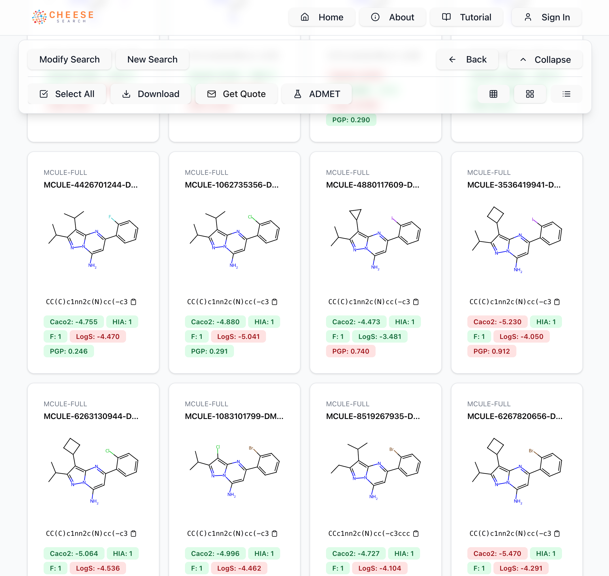

---

title: "My Flight from Flask to React, via Streamlit and Dash"
summary: "Web pages used to feel like the most boring part of programming—until I discovered React. In this post I reflect on my coding journey from the backend to the frontend."
date: "June 13 2025"
draft: true
category: tech
tags:
- React
- Frontend
- Typescript
- CHEESE
- Flask
- Vite
- Streamlit
- Dash
- Python 
- Tailwind
thumbnail: cheese_float.png
toc: true
---

import Table from '@components/Table.astro';
import References from '@components/References.astro';
import Citation from '@components/Citation.astro';
import Cite from '@components/Cite.astro';


When I wrote my first line of code as a kid, it was probably a script to self‑host a Minecraft server, a program for a LEGO robot written in C, a Linux Bash script, or a bit of Java in Processing. Later, I relied heavily on Python and Jupyter Notebooks for data analysis. Web or frontend? I wasn’t interested at all—it felt *so boring*.

In my first full‑stack job I programmed in Flask, using Jinja templates and Bootstrap. It worked up to a point, but every time I needed to go beyond what the templates provided, it was a pain in the ass. In later projects I usually used a combination of Streamlit, Dash, and Flask. Most of the time I picked the *lowest‑friction* toolset, crafting the frontend out of necessity, not because I enjoyed it. To be fair, I was more of a backend developer, so it wasn't expected from me.

Last fall I skimmed through some React basics and soon fell in love. Now I consider myself a proficient frontend vibecoder. Before I outsource the UI to someone more experienced, I want to enjoy it for a while–even for an amateur–it feels so satisfying.


*Example: [CHEESE Search](https://cheese-new.deepmedchem.com) UI I wrote in React.*

## My frontend stack now at Deep MedChem

Let's jump to the present. You can see a lineup from Streamlit prototypes (such as Electrostatics or Modeller) to a Flask + Dash dashboard in Explorer, up to the UI I'm currently most proud of: CHEESE Search.

<Table
  headers={["Product", "Stack", "Website"]}
  rows={[
    ["CHEESE", "React + TypeScript + Vite + Tailwind", "https://cheese-new.deepmedchem.com"],
    ["Explorer", "Flask + Python + Dash + HTML/CSS", "https://explorer.deepmedchem.com/"],
    ["Electrostatics", "Streamlit + Python", "http://electrostatics.deepmedchem.com/"],
    ["Modeller", "Streamlit + Python", "http://modeller.deepmedchem.com/"],
    ["Deep MedChem", "Webflow", "https://deepmedchem.com/"]
  ]}
  striped={true}
  bordered={true}
  hover={true}
/>

## Which technology to choose?

I have no strong opinion about what is better: the right approach is to know what you the end-product should be. 

* Need an MVP overnight? Pick Streamlit.
* Hassle‑free CRUD with SQL? Use Flask + SQLAlchemy.
* Production‑grade, highly maintainable UI, even if it takes twice as long to write and type‑check? Go for React + TypeScript. 

## Simple vs Complicated: What I hate in modern web dev

What intimidated me during my first React “Hello World” was the sheer number of files. While most developer tools get simpler year after year, web dev seems to have become 10x more convoluted compared with the days when HTML, PHP, and CSS were enough.

To illustrate my point, take how it looks after you create a new, say, NextJS project (excluding gitignored files):

```
└── hello_world
    ├── app
    │   ├── favicon.ico
    │   ├── globals.css
    │   ├── layout.tsx
    │   └── page.tsx
    ├── eslint.config.mjs
    ├── next.config.ts
    ├── package-lock.json
    ├── package.json
    ├── postcss.config.mjs
    ├── public
    │   ├── file.svg
    │   ├── globe.svg
    │   ├── next.svg
    │   ├── vercel.svg
    │   └── window.svg
    ├── README.md
    └── tsconfig.json

4 directories, 16 files
```

And compare it with a similar streamlit project:
```
hello_world.py
```

And a simple code enough to produce a solid, modern webpage:
```python
import streamlit as st

st.title("Hello, world! 👋")
```

## Distinction between dashboards and webpages


## When streamlit is (not)enough

If you have a simple usecase: an app with three buttons and a table, chat window, simple plotting dashboard, deployment od an AI model from huggingface or a search bar and results, in almost all the cases streamlit (or gradio or other such frameworks) will serve the purpose well. Again: what you get just for few lines of code is unparalleled.

 
*Example: [Electrostatics](https://cheese-new.deepmedchem.com) A streamlit UI for molecule partial charges.*

However, the darkside of such an easy way to make a frontend is that these *relatively new* frameworks are still a bit experimental and glitchy or buggy time to time. For instance streamlit is not so well suited for interactivity and sometimes flickers or displays ghost components. There are some deeper technological reasons why it is not so easy (or maybe currently close to impossible) to generalize this paradigm and simplify all web development using this approach. I am not going to dive into it here. 

*Tip: Checkout the [Streamlit App Gallery](https://streamlit.io/gallery?category=favorites) to get a gist of what it can do.*


*This [CHEESE Search](https://cheese-new.deepmedchem.com) database selection widget with a slider and a multiselect wouldn't be a huge problem to replicate in streamlit*

## Where I ended up

Currently my go-to stack when creating a new app consist of Vite and Express (as a proxy server) where I write in React/Typescript, Tailwind CSS and usually Shadcn-UI as a component library. Sometimes I am trying new things. for instance this blog page is written in Astro JS and in other projects I have encountered as well NextJS or Vue (though i have no experience with them).


*[CHEESE Search](https://cheese-new.deepmedchem.com) Ketcher drawing pad with search bar and some buttons*

## Vibe-coding tips

Tailwind CSS is a life-hack if you are using GPT to help you design your page. Large language models have sometimes a problem remember long context or making edits in multiple files at once and having inline css simplifies this a lot. Typescript is also a must-have, because it prevents LLMs introducting easily-preventable bugs and force them to be type consistent accross the whole codebase.
At this time point (June 2025) I still don't find LLMs 100% useful in large typescript codebases. A month ago I was still manually selecting code snippets from the relevant files and copy-pasting them to another window with LLM chat opened, then I checked the generated results and inserted them manually back. Only recently I started to play with tools such as Roo Code or Aider.


<References title="References">
  <Citation id="reactDocs">
    <a href="https://react.dev/"><em>React Documentation</em></a>
  </Citation>

  <Citation id="flaskDocs">
    <a href="https://flask.palletsprojects.com/"><em>Flask Documentation</em></a>
  </Citation>

  <Citation id="streamlitDocs">
    <a href="https://docs.streamlit.io/"><em>Streamlit Documentation</em></a>
  </Citation>

  <Citation id="streamlitGallery">
    <a href="https://streamlit.io/gallery"><em>Streamlit App Gallery</em></a>
  </Citation>

  <Citation id="dashDocs">
    <a href="https://dash.plotly.com/"><em>Dash Documentation & User Guide</em></a>
  </Citation>

  <Citation id="viteDocs">
    <a href="https://vite.dev/"><em>Vite Official Docs</em></a>
  </Citation>

  <Citation id="tailwindDocs">
    <a href="https://tailwindcss.com/docs"><em>Tailwind CSS Documentation</em></a>
  </Citation>

  <Citation id="shadcnUi">
    <a href="https://ui.shadcn.com/"><em>shadcn/ui Documentation</em></a>
  </Citation>

  <Citation id="nextjsDocs">
    <a href="https://nextjs.org/docs/app/getting-started/project-structure"><em>Project Structure – Next.js Docs</em></a>
  </Citation>

  <Citation id="rooCode">
    <a href="https://aiagentstore.ai/ai-agent/roo-code"><em>Roo Code – Autonomous Coding Agent</em></a>
  </Citation>

  <Citation id="aider">
    <a href="https://github.com/Aider-AI/aider"><em>Aider – AI Pair Programming</em></a>
  </Citation>
</References>
