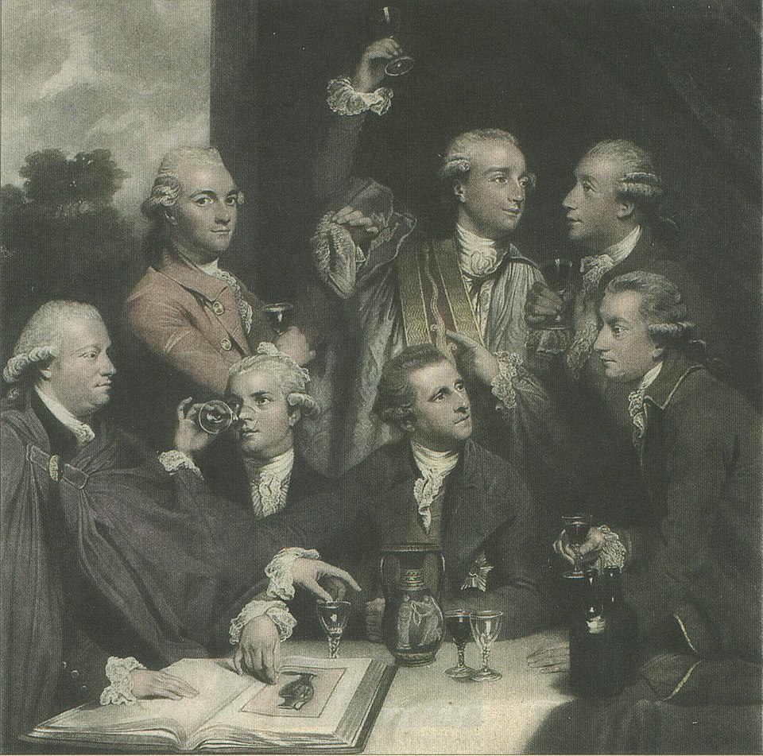

Some conversation: https://chatgpt.com/c/6828f935-c318-8005-817a-8730917c1f43

The scientific success of our civilization is build upon the pursuit of specialization. In my own life I have soon realized that the opposite – broad range of random interests, entangled distractions and contradicting goals – will pave my road. To be honest, I hate myself in this aspect and I am activelly trying to tame my curiosity in purposeful manner – but I cannot change my nature from the ground up. This unfinished essay is about coming to terms with a trait of mine in roundabout way, starting with a detour in modern intellectual history: from the original society of dilletanti originating in italy through Benjamin's flâneur, Montaigne's praise of ecclecticism, Edward Said, Michel Foucault, Susan Sonntag essays and Claude-Levi Strauss thematization of bricolage. Finally, I talk about what does dilletantism mean to me personally.

## The Society of Dilettanti (1734)

## From flânerie to bricolage 

## Dilletants, amateurs, pseudo-intellecutals and charlatans

## What if academia was about having fun?

## The structure of Scientific Revolutions

## Dilletantism in my own experience

My interests and educational path covers

