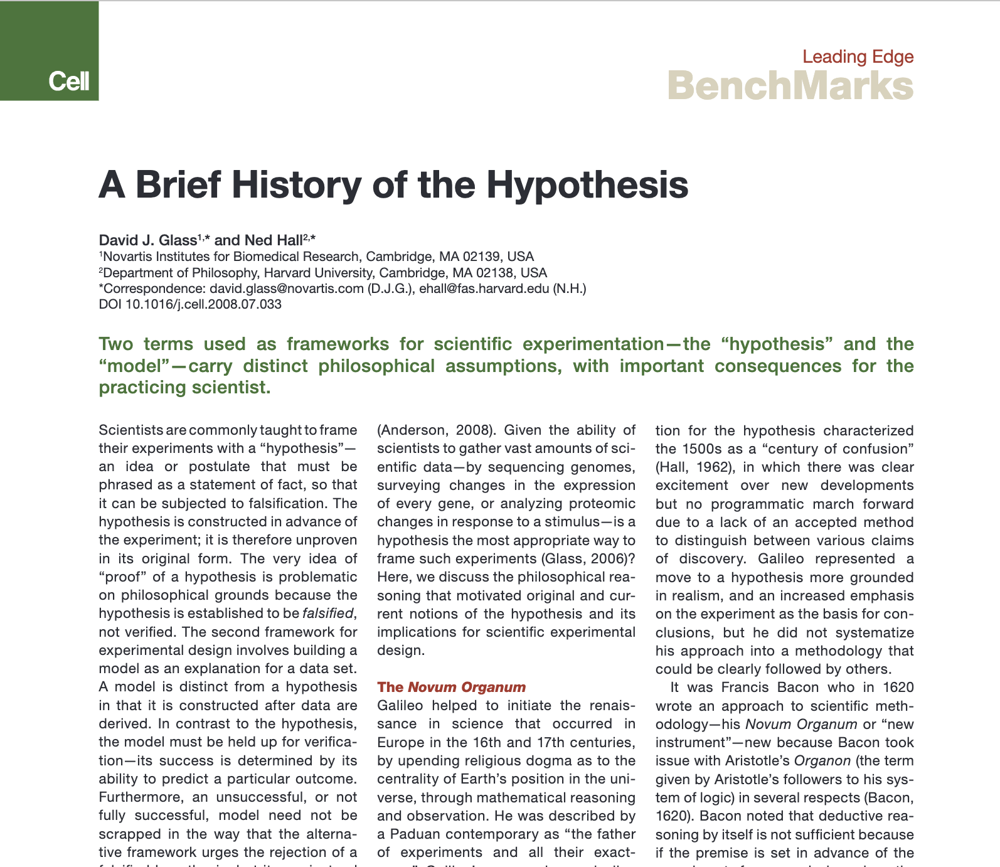

import References from '@components/References.astro';
import Citation from '@components/Citation.astro';
import Cite from '@components/Cite.astro';

*“It is better to see science as a quest for good questions to try to answer, rather than a quest for bold hypotheses to try to refute.”*
– Glass and Hall <Cite id="glasshall2008" />

O tvrzeních testovaných vědeckými experimenty mluvíme jako o “modelech”, nebo “hypotézách”. Tyto dva pojmy bývají někdy volně zaměňovány, autoři článku <Cite id="glasshall2008" /> však tvrdí, že nejde o marginální distinkci, nýbrž o rozdílné sady filosofických předpokladů; a jestli vědeckou praxi rámujeme skrze modely nebo hypotézy, které teprve experimentálně testujeme, má zásadní důsledky do podoby vědecké experimentální praxe. Autoři se distancují od diskurzu kritického racionalismu, představovaného zejména Karlem Popperem, založeného čistě na principu vědy jako praxe předkládající hypotézy k falsifikaci, aby se zamezilo “problému indukce” – dochází naopak k tomu, že současná vědecká praxe se narozdíl od té historické obejde úplně bez hypotéz. Hypotézy nutí vědce k zaujmutí určité teze, bývají předpojaté nebo partikulární a jejich logická falsifikace, jakou Popper navrhuje, nemusí být konkluzivní; autoři proto navrhují místo hypotéz pokládat konstruktivní otázky.
S nevídaným nárůstem dat a měřících přístrojů, jako jsou například genomické a proteomické databáze nebo urychlovače částic, které produkují každý časový okamžik petabajty dat, není už prostor pro vymýšlení hypotéz <Cite id="anderson2008wired" />, a naopak se vědecká praxe odvíjí od zpracování dat, k čemuž používá modely. Modely odpovídající datům svými predikcemi se však nepředkládají k falsifikaci, ale stačí je odladit.

## Indukce a dedukce, model a hypotéza

Hypotéza je poměrně volně motivované vědecké tvrzení o předpokládané skutečnosti, které slouží jako premisa pro další zkoumání. Deduktivně se z ní vyvozují závěry, které lze testovat: “top-down deduction from premises”. Modely oproti tomu vytváříme až na základě naměřených empirických dat pomocí “bottom-up data/ induction.” a úspěšnost modelu je dána tím, do jaké míry na data pasuje.[^fitexplanation] Záleží na tom, jak jsou predikce modelu přesné a pokud nejsou dostatečně přesné, neznamená to, že je model vyvrácen, falsifikován (jako by tomu bylo u hypotézy), ale většinou na něm jde začít a postupně jeho predikce vylepšovat. Historicky se vědecká metoda od hypotéz distancovala: Baconovo Novum Organum se snaží vědu založit čistě experimentálně, Newton hrdě prohlašuje, že nemá žádné hypotézy, “hypotheses non-fingo”, a kritický racionalismus Karla Poppera logiku verifikace hypotéz obrací metodou logické falsifikace: všechny hypotézy jsou tak nakonec předurčené k vyvrácení, čímž si věda zachovává objektivitu.

## Galileo a Bacon – Vědecká tradice a Novum Organum

Galileo je znám svým hypoteticko-deduktivním přístupem k vědeckým teoriím – zejména pak podpořením Koperníkovy heliocentrické teorie pomocí kvantitativních experimentů. Autoři dodávají, že zatímco Galileo se svými teoriemi proslavil, ta samá vědecká metoda navazující na řecké předchůdce, Aristotela a Archimeda, nefungovala každému. Praxe spočívala v postulování – mnohdy spekulativních, fantastických nebo dogmatických – hypotéz, ze kterých se odvozovaly fyzikální, astronomické nebo další vědecké teorie. Experimenty, jako u Galilea, pak sloužily pouze k ilustraci těchto hypotéz <Cite id="koyre2004" />. Hall <Cite id="hall1962" /> tak nazývá 16.století stoletím konfúze: “a century of confusion”, protože vznikalo spoustu teorií a zdánlivých objevů, ale nešlo jasně rozlišit mezi těmi metodicky správnými a fikčními či nerealistickými. Bacon v roce 1620 proto přichází s vědeckou metodologií *Novum Organum,* kde argumentuje, že deduktivní vyvozování z předem přijatých premis není důvěryhodné, protože uvažování pak může být zkresleno, aby vyhovovalo předem přijatým premisám. Bacon proto argumentuje, že je nutné přijmout induktivní metodologii založenou čistě experimentálně. Indukce spočívá v inferenci predikcí z datasetu, tak by predikce generalizovali do budoucích okolností: “Předpověď, že padající jablko se bude v budoucnu chovat stejně jako v minulosti, je induktivní úvaha, stejně jako rozšíření poznatků na další objekty, jako je pomeranč nebo meteorit.” Rozdíl mezi předchozí Galilelovskou metodologií, která zahájila revoluci v evropské vědě díky zdůraznění role experimentálního ověřování, spočíval v přísném postavení experimentálních dat, nikoli již existující ideologie, jako základu vědecké práce.

## Hume a Popper – Problém indukce

Myšlenku, že minulé zkušenosti lze použít jako "důkaz" budoucích výsledků, odmítl v 18\. století skotský filozof David Hume, což se později proslavilo jako “problém indukce”. V rámci jeho “radikální skepse” si nemůžeme být jisti ani tím, že zítra vyjde znovu slunce, ani tím, že budou stále platit zákony gravitace. Není to jisté proto, že to je založené na nedokázaném předpokladu, chcete-li hypotéze, že věci zůstávají stejně v budoucnosti jako v minulosti, že se příroda chová uniformně. Abychom byli vědecky poctiví, nesmíme však stipulovat žádný takový nedokázaný předpoklad.
Karl Popper přijímá Humovu radikální skepsi a snaží se vyhnout problému indukce tím, že hypotézám ubere jejich závaznost: bude je brát jako výroky určené k falsifikaci, vyvrácení, a nikoli k verifikaci, potvrzení. Zatímco hypotézy je téměř nemožné kompletně potvrdit, stačí jeden experimentální fakt nebo protipříklad, aby byly vyvráceny. Zároveň předpokládáme, že hypotézy lidi zakládají na svých zkušenostech, které jsou ale vždycky omezené, a premisy tak nikdy nebudou pravdivé; to ale není problém, protože právě cestou falsifikace hypotéz a právě předpokladem jejich nepravdivosti můžeme směřovat k pravdě. Navíc jde o praxi, kterou se věda liší od doktríny: všechny hypotézy budou jednou vyvráceny a věda se tím posunuje. Naopak nemá žádné centrální dogma nebo ideologii, na které by stála a se kterou by padala.

## Limity kritického racionalismu

Nejčastějším argumentem proti Popperově pozici však zůstává, že kritický racionalismus se nedokáže vyhnout induktivnímu uvažování (Kuhn, 1977). Vědci pořád vytvářejí hypotézy a ty musí být nějak motivované jsou tím implicitně předpojaté. Poincaré dodává: "Často se říká, že experimenty by se měly dělat bez předsudků. To je nemožné. Nejenže by tím byl každý experiment bezvýsledný, ale i kdybychom si to přáli, nebylo by to možné" (Poincaré, 1952). Kuhn a Nozick dále namítají, že Popperova falsifikace je pouze logická, ale nikoliv konkluzivní v experimentálním kontextu: aby byla hypotéza vyvrácena, stačí na to jediný protipříklad. Avšak jediný protipříklad vyvrácení hypotézy nezaručí: lze ho ignorovat nebo říci, že se na něj hypotéza nevztahuje, a kdyby měla na základě něho hypotéza vyvrácena celá, nemusí to znamenat, že byla kompletně nepravdivá. Popperovo uvažování funguje ve světě logických formulí, kde platí ex contradictione sequitur quodlibet.[^excontradictione] Neplatí také jeho předpoklad, že by předchozí zkušenosti nebyly relevantní a nezáviselo na nich: Glass podotýká, že “problém indukce” je částečně řešitelný probabilistickým pohledem na vědecké experimenty: pokud ukážeme, že se v signifikantní kvantitě opakuje jev A, v nějakou chvíli začne být odpovědnost kritika, aby dokázal non-A nebo B. Jestli bude konstruktivní danou hypotézu verifikovat nebo falzifikovat závisí na předchozích praděpodobnostech.
Pokud by se na základě námitek proti falzifikaci hypotéz přešlo k verifikaci, objevily by se ty samé námitky jako u Bacona a Huma. Hypotéza může přinášet předpojetí do rámování experimentu, zaměřovat pozornost na určitý typ výsledku a třídit podle toho data, čímž může dojít k faktickému zkreslení. Glass proto navrhuje paradigma “hypotézy” úplně opustit.

## Model a otázka

Pokud opustíme rámování experimentů pomocí hypotéz; co nám zbude předtím, než získáme dostatek dat, abychom mohli vytvářet modely a dále je vylepšovat? Glass tvrdí, že adekvátní náhrada za hypotézy jsou otázky: vědu bychom měli chápat spíše jako hledání dobrých otázek, na které se snažíme odpovědět, než jako postulace odvážných hypotéz, které si navzájem vyvracíme. Otázku tak budeme pojímat jako prostředek, který nám umožňuje dobrat se konkrétních dat k vytvoření modelu.

## Diskuze

Od vydání článku A Brief History of the Hypothesis se v biologických disciplínách čím dál více akcentuje takzvaná krize reprodukovatelnosti (“reproducibility crisis”) vědeckých experimentů <Cite id="ioannidis2005" />. Vzniká spoustu článků, které upozorňují na různé potenciální korelace nebo falsifikují partikulární fakty. National Institutes of Health (NIH) dokonce preferuje, aby žádosti o grant začínaly falsifikovatelnou hypotézou; faktem ale zůstává, že pouhý zlomek z článků je pak reprodukovatelný, a i když prezentují statisticky signifikantní výsledky, jejich rámování může být zavádějící a vědecky kontraproduktivní.
V publikaci Experimental Design for Biologists <Cite id="glass2006" />, na kterou článek úzce navazuje, Glass ukazuje, že rámování pomocí hypotézy založené na bázi postulace tvrzení může upozaďovat kladení relevantních otázek, a navíc může vést vědce k preferování pozitivních výsledků, namísto experimentálního vyčerpání potenciálu daného experimentu pomocí patřičných kontrolních prvků. Jako příklad dává článek testující hypotézu "caffeine causes cancer", která nalezne signifikantní korelaci mezi jedním z 99 typů rakoviny a pitím nápojů obsahujících kofein (konkrétně u rakoviny slinivky), čímž se hypotéza potvrdí.[^strawman] Mohlo však jít o statistickou náhodu, a pro dobrání se vědecké pravdy by bylo nutné rámovat experiment spíše otázkou, jaká je kauzalita mezi pitím kofeinu a různými typy rakoviny (zejména rakovinou slinivky) a vytvářením konkrétních modelů.
Jako velmi aktuální se rovněž ukazuje důraz na zpracování velkých dat, který předjímal již výše zmiňovaný Anderson <Cite id="anderson2008wired" /> – s nárůstem výpočetní kapacity a technikami strojového učení se podle něj stávají hypotézy nepotřebné, a dokonce tvrdí, že se věda pospouvá i za éru modelů, ve smyslu lidmi nakonfigurovaných expertních systémů: umělá inteligence a matematická optimalizace fungují tak, aby si modely vytvořily samostatně, ideálně bez lidského zásahu a expertní znalosti. Andersonovu tezi, že se pomalu dostáváme i za éru modelů by potvrzoval například systém AlphaFold <Cite id="jumper2021" />, který se pomocí umělé inteligence naučil skládat proteiny a překonal mnohé expertní systémy a lidmy vyvíjené modely.
Potenciální kritika článku by se mohla ubírat směrem relativizace metodologické odloučenosti “modelů” a “hypotéz” – víme například, že mnohé teorie začínají jako hypotézy, které jsou však úzce provázané s konkrétními modely a nelze říct, že by šlo o čistý model nebo hypotézu. Na to narazíme v teorii relativity, která je sice hypotézou o povaze časoprostoru, zároveň ale konkrétním modelem, sadou vzorců. V kontextu struktury vědeckých revolucí <Cite id="kuhn1997" /> si pak lze jen těžko představit, že by se změny vědeckých paradigmat jako je kopernikánský obrat od geocentrismu k heliocentrismu nebo obrat od newtonovské k einstenovské fyzice odehrávali pouhým “laděním modelů” a vědecký pokrok, který často mění interpretaci základních pojmů nebo představ o realitě, se mohl obejít bez hypotéz. Autoři v poslední části navrhují, že pokud není dostatek dat, namísto postulace hypotéz bychom měli klást otázky; není ale dostatečně rozvedeno, jestli se otázky od hypotéz výrazně liší a jestli se vymykají předpojatosti. Kritik by mohl namítnout, že jde o formální záležitost větné syntaxe a že otázky lze formulovat jako hypotézy, a naopak – problémy, na které článek naráží by pak byly hlubší a spočívali by spíše v širších otázkách vědecké metodologie jako takové – tak i navrhujeme článek interpretovat a dále zkoumat, jak vědecký výzkum rámovat, aby v něm byl patrný viditelný progres, ale zároveň aby se v zájmu senzace neupustilo od měřítek vědecké relevance. Rámování pomocí hypotéz výsledky článků prezentuje uchopitelně a zasazuje do měřitelných milníků pomocí dialektiky verifikace a falsifikace, proto může být podle nás přitažlivé pro grantové komise i pro vědce samotné; věda však spočívá spíše v hledání dobrých otázek a jejich dlouhodobém výzkumu, nikoli v jednorázových výsledcích. Měli bychom být proto maximálně obezřetní, než dojdeme k jednoznačnému, dobře prezentovatelnému závěru, ke kterému nás rámcování pomocí hypotéz může svádět.[^finalthoughts]

<References title="Reference">
<Citation id="glasshall2008">
Glass, D. J., & Hall, N. (2008). <a href="https://doi.org/10.1016/j.cell.2008.07.033"><em>A Brief History of the Hypothesis</em></a>. Cell, 134(3), 378–381. ISSN 0092-8674. (<a href="https://www.sciencedirect.com/science/article/pii/S0092867408009537">Sciencedirect</a>)
</Citation>
<Citation id="anderson2008wired">
Anderson, C. (2008, July 16). <a href="http://www.wired.com/science/discoveries/magazine/16-07/pb\_intro"><em>The End of Theory: The Data Deluge Makes the Scientific Method Obsolete</em></a>. Wired magazine, 16(07). (Original title was "The End of Theory", link points to "pb\_intro" which was likely "The Petabyte Age" intro to the piece, the article discusses data rendering hypotheses obsolete.)
</Citation>
<Citation id="koyre2004">
Koyré, A. (2004). <em>Od uzavřeného světa k nekonečnému vesmíru</em>. Praha: Vyšehrad. (261 stran)
</Citation>
<Citation id="hall1962">
Hall, A. R. (1962). <em>The Revolution in Science 1500–1750</em>. London: Longman.
</Citation>
<Citation id="ioannidis2005">
Ioannidis, J. P. A. (2005, August 1). <a href="https://doi.org/10.1371/journal.pmed.0020124"><em>Why Most Published Research Findings Are False</em></a>. PLOS Medicine, 2(8), e124. ISSN 1549-1277. PMC 1182327. PMID 16060722.
</Citation>
<Citation id="glass2006">
Glass, D. (2006). <em>Experimental Design for Biologists</em>. Cold Spring Harbor, NY: Cold Spring Harbor Laboratory Press.
</Citation>
<Citation id="jumper2021">
Jumper, J., Evans, R., Pritzel, A., Green, T., Figurnov, M., Ronneberger, O., ... & Hassabis, D. (2021). <a href="https://doi.org/10.1038/s41586-021-03819-2"><em>Highly accurate protein structure prediction with AlphaFold</em></a>. Nature, 596(7873), 583–589.
</Citation>
<Citation id="kuhn1997">
Kuhn, T. S. (1997). <em>Struktura vědeckých revolucí</em>. Praha: OIKOYMENH.
</Citation>
</References>