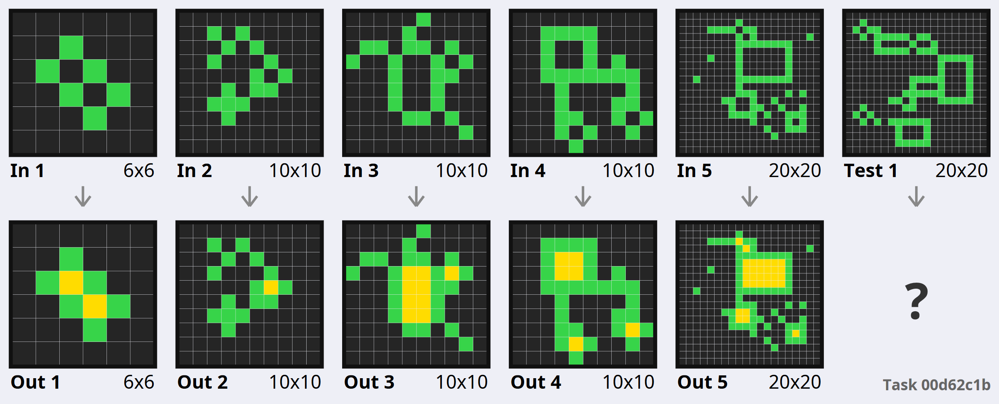
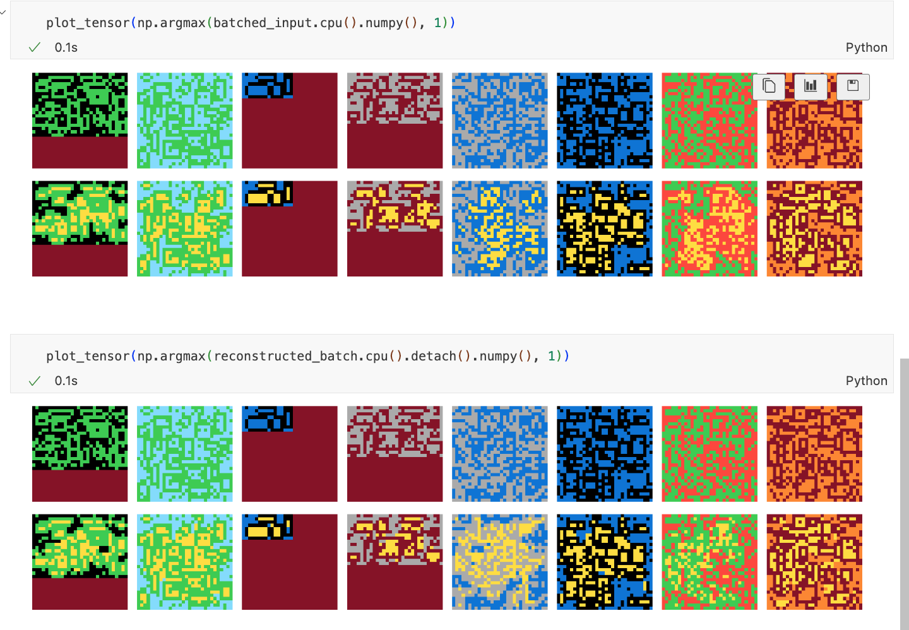
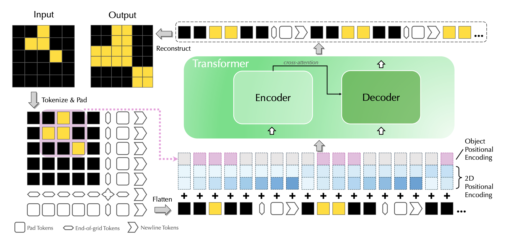

I tried, and failed, to get Vision Transformers to work on the ARC challenge. The ARC challenge is a set of tasks that require abstract reasoning to solve. I tried to use Vision Transformers to solve the tasks, but I was not able to get them to work. Below is an example of an infilling task from the ARC challenge.

## Training

I trained a custom ViT implemented in pytorch with one-hot encoded (10 channel) input and 2D positional embeddings with around 100M params on a sample task to infill the topologically enclosed region in the input grids. The model was trained on a dataset of around 100K such generated examples from re-arc with randomized sizes and colors. The model was seemingly converging and getting better, but 100% accuracy was never achieved.

Here are ground truth examples and prediction from my model. Can you spot the difference?

## What to do next?
Later this year I encountered VitARC which significantly improves the performance of ViTs on ARC tasks and partially addresses this problem: [https://arxiv.org/abs/2206.06709](https://arxiv.org/abs/2206.06709)

## Fundamental Limitations?
Through this project, I got increasingly skeptical about the ability of Vision Transformers to solve abstract reasoning tasks. My thinking was that 2D spatial information through positional embeddings will improve the performance a lot in contrast to 1D sequential NLP approach. However there are still some fundamental problems with `taking shortcuts` instead of learning the underlying rules.

