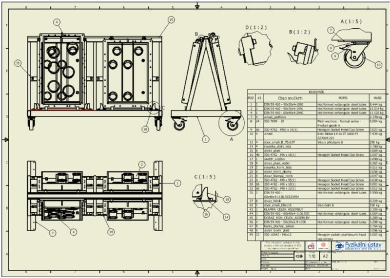
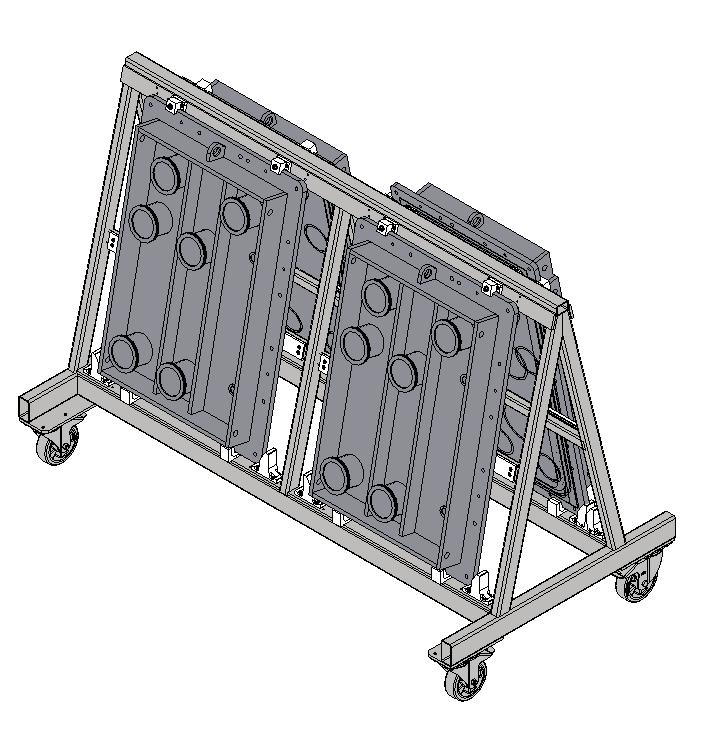

Developed a moving steel frame construction helping with vacuum chamber door storage. Needed to overcome heaviness of the load and safety of the operations. Project under Ing. Petr Strkula.
After numerous simulations, the frame was constructed as per my design and is now used in L1 laser hall.

