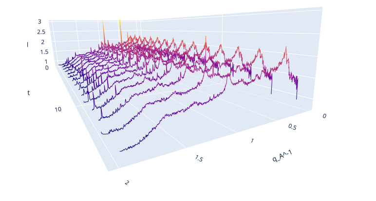

Contract work with Dr. Borislav Angelov (Department of Structural Dynamics in ELI Beamlines) in X-ray diffraction spectroscopy. During the contract I created a software package for the experimental data processing and visualisation and helped also with with the control of central diffraction sensor.

