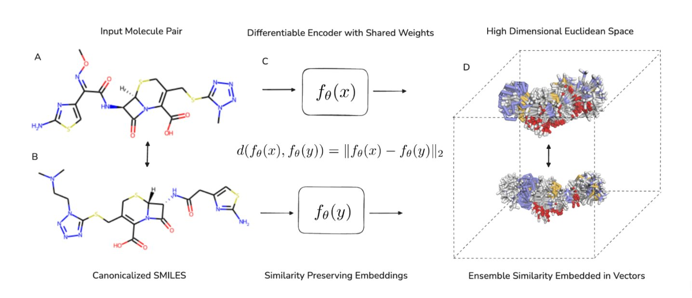

## Abstract

Molecular similarity search is crucial for effective ligand-based virtual screening, with various metrics available to compare molecules on different levels. However, many informative similarity metrics are computationally intensive, limiting their use in large databases. CHEESE (CHEmical Embeddings Search Engine) framework effectively reformulates ligand-based virtual screening as an approximate nearest neighbor search, making it manageable with modern vector databases and indexing algorithms. We present a general framework that can accommodate any molecular similarity metric and specifically develop and assess it using two key metrics: 3D shape and electrostatic similarities. We demonstrate CHEESE effectiveness in virtual screening on established ligand-based virtual screening benchmarks, including DUD-E, LIT-PCBA, and Sidechain Virtual Screening (with 101, 15, and 202 targets, respectively). Our results showcase its state-of-the-art performance compared to leading 2D and 3D methods, achieving speed improvements of up to three orders of magnitude and reducing computational costs by six orders of magnitude.

## Citation

```bibtex
@article{lzicar_cheese_2024,
    author = {Lžičař, M. and Gamouh, H.},
    title = {{CHEESE}: {3D} Shape and Electrostatic Virtual Screening in a Vector Space},
    journal = {ChemRxiv},
    year = {2024},
    doi = {10.26434/chemrxiv-2024-cswth},
    note = {Preprint},
    url = {https://doi.org/10.26434/chemrxiv-2024-cswth}
}
```
